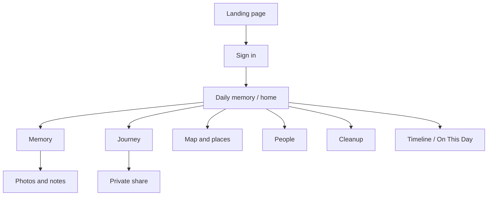

---
tags:
  - ux/ia
status: active
---

# Information Architecture

## Primary hierarchy

Journey → memory/place → photos, people, dates, and notes.

The app should help users move between the emotional story view and the
structured record without making either one feel secondary.
