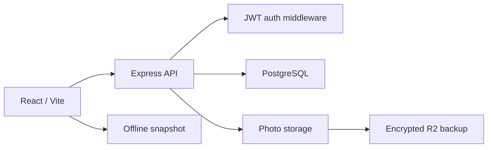

---
tags:
  - engineering/architecture
status: active
---

# Architecture Overview

## Current boundaries

- **Frontend:** React, Vite, Tailwind, page and context state.
- **API:** Express routes and authenticated ownership checks.
- **Database:** PostgreSQL records for users, households, journeys, memories
  (legacy table name: `trips`), travelers, and related data.
- **Photos:** resized display images, thumbnails, metadata, and private storage.
- **Authentication:** username/password, bcryptjs, and JWT during beta.
- **Operations:** Docker on Ubuntu with Cloudflare Tunnel and encrypted backups.

## Change rule

New account providers must terminate at the existing internal user/session
boundary. They should not spread provider-specific assumptions through product
records or household ownership logic.
